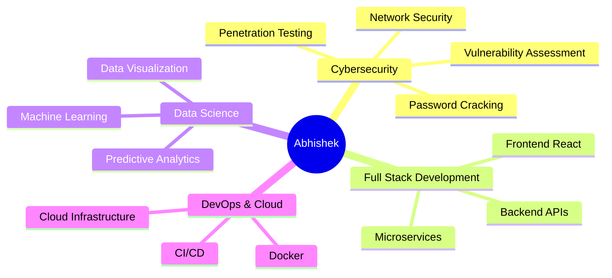

# 👋 Hey there, I'm Abhishek!

<div align="center">
  
[](https://git.io/typing-svg)

</div>

---

## 🚀 About Me

```python
class Developer:
    def __init__(self):
        self.name = "Abhishek"
        self.username = "Abhishek88788"
        self.role = "Full Stack Developer & Security Researcher"
        self.language_spoken = ["en_US", "hi_IN"]
        self.code = ["Python", "JavaScript", "Java", "C", "C++", "SQL", "Bash"]
        self.interests = ["Cybersecurity", "AI/ML", "Web Development", "Data Science"]
        self.location = "Uttar Pradesh, India"
    
    def say_hi(self):
        print("Thanks for dropping by! Let's build something amazing together!")

me = Developer()
me.say_hi()
```

---

## 💻 Tech Arsenal

<div align="center">

### 🔤 Languages


### 🎨 Frontend & Frameworks


### 📊 Data Science & ML


### 🗄️ Databases


### 🔒 Cybersecurity Arsenal


### 🛠️ Tools & IDEs


</div>

---

## 📊 GitHub Statistics

<div align="center">
  


</div>

<div align="center">
  


</div>

---

## 🏆 GitHub Trophies

<div align="center">
  
[](https://github.com/ryo-ma/github-profile-trophy)

</div>

---

## 📈 Contribution Graph

<div align="center">

[](https://github.com/ashutosh00710/github-readme-activity-graph)

</div>

---

## 🎯 Skill Spectrum

<div align="center">



</div>

---

## 🌟 Featured Projects

<div align="center">

[](https://github.com/Abhishek88788/YOUR_REPO_1)
[](https://github.com/Abhishek88788/YOUR_REPO_2)

</div>

---

## 💻 Coding Activity

<div align="center">

<!--START_SECTION:waka-->
<!--END_SECTION:waka-->

</div>

---

## 📫 Connect With Me

<div align="center">

[](https://linkedin.com/in/YOUR_PROFILE)
[](https://twitter.com/YOUR_HANDLE)
[](https://YOUR_WEBSITE.com)
[](mailto:your.email@example.com)
[](https://github.com/Abhishek88788)

</div>

---

<div align="center">

### 💭 Random Dev Quote


---

### 📊 Profile Stats


---

### ☕ Support My Work
[](https://buymeacoffee.com/YOUR_USERNAME)
[](https://paypal.me/YOUR_USERNAME)

</div>

---

<div align="center">
  
**⭐ From [Abhishek88788](https://github.com/Abhishek88788)**

### *"First, solve the problem. Then, write the code."* – John Johnson

</div>

---

<div align="center">

### 🔥 Streak Stats


### 📈 Contributions


</div>

---


<div align="center">


</div>
